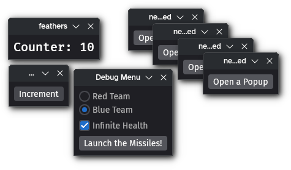

# bevy_window_as_ui_root


Easily spawn windows as independent UI roots. Ideal for debug widgets!

## Usage

```rust
app.add_plugins(WindowAsUiRootPlugin);

commands.spawn((
  WindowAsUiRoot,
  BackgroundColor(Color::WHITE),
  children![(
    Text::new("Hello World!"),
    TextColor(Color::BLACK),
  )],
));
```

Insert the `WindowAsUiRoot` component on an entity and this plugin will:

- Insert `Node`, `Window`, and `Camera` components if they don't already exist.
- Connect the camera to the root node and window.
- Automatically resize the window to match the root node's layout size (if it is auto or fixed).

## Tips
- Use the `CloseWith` relation to automatically close nested windows.
- Set `WindowPlugin.exit_condition` to `ExitCondition::OnPrimaryClosed` to prevent popups from outliving the main window.
- Insert `Node { width: percent(100), height: percent(100), ..default() }` on the UI root to make it resizable by the user.

## Bevy Version
The `main` branch currently targets Bevy `0.17`.\
Crate version `0.1.0` targets Bevy `0.17`.

## License

Licensed under either of

 * Apache License, Version 2.0
   ([LICENSE-APACHE](LICENSE-APACHE) or <http://www.apache.org/licenses/LICENSE-2.0>)
 * MIT license
   ([LICENSE-MIT](LICENSE-MIT) or <http://opensource.org/licenses/MIT>)

at your option.

## Contribution

Unless you explicitly state otherwise, any contribution intentionally submitted
for inclusion in the work by you, as defined in the Apache-2.0 license, shall be
dual licensed as above, without any additional terms or conditions.
